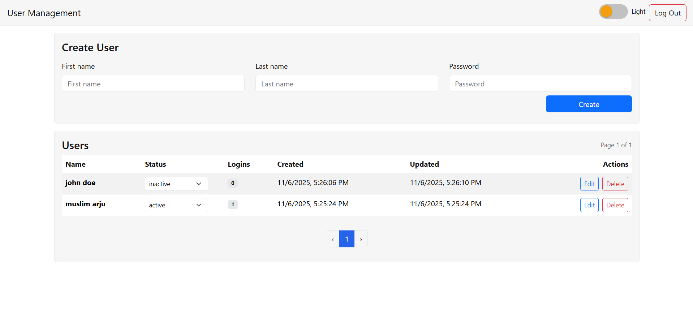

# Back‑office User Management System

Live demo: https://coding-challenge-user-manage-web.vercel.app

Full‑stack solution for the Coding challenge. Implements user/session APIs, a React (NextJS) dashboard, theme toggle, and automated tests.



Monorepo layout

- `backend/` – Express + TypeScript + Mongoose
- `web/` – Next.js App Router + TypeScript + React‑Bootstrap
- `docker-compose.yml` – MongoDB + backend + web

Covers all requested parts

- Part 0 – REST APIs for Users and Sessions with domain validations
- Part 1 – Sign‑up/Sign‑in page with session handling
- Part 2 – User management dashboard (list, paginate, create, update, delete)
- Part 3 – Theme customization (light/dark persisted)
- Part 4 – Tests (Vitest API tests + Playwright E2E)

---

## Run With Docker

Requires Docker Desktop.

```bash
docker compose up --build
```

- Web: http://localhost:3000
- Backend: http://localhost:4000
- MongoDB: localhost:27017

Stop: `Ctrl+C` then `docker compose down -v` (remove volumes) if needed.

---

## Local Development (no Docker)

From the repo root (uses npm-run-all to run both apps concurrently):

```bash
npm install          # once
npm run dev          # backend:4000 + web:3000 concurrently
```

Environment

- Backend reads `MONGO_URI` and `PORT` from env (see below). If it cannot reach Mongo, it automatically falls back to an in‑memory MongoDB (mongodb‑memory‑server) for development and tests.
- Web reads `NEXT_PUBLIC_API_BASE` (defaults to `http://127.0.0.1:4000/api`).

### Local MongoDB setup

Option A – Local Mongo

- Install MongoDB Community Server, then run it locally.
- Use URI: `mongodb://127.0.0.1:27017/backoffice_user_manager`

Option B – MongoDB Atlas

- Create a cluster and obtain a connection string, e.g. `mongodb+srv://<user>:<pass>@<cluster>/backoffice_user_manager?retryWrites=true&w=majority`
- Set `MONGO_URI` to that value.

### .env examples

Create `backend/.env` (optional when using defaults or in‑memory fallback):

```
MONGO_URI=mongodb://127.0.0.1:27017/backoffice_user_manager
PORT=4000
```

Create `web/.env.local` if you need to override:

```
NEXT_PUBLIC_API_BASE=http://127.0.0.1:4000/api
```

---

## Testing

Single command runs everything (backend unit/API + Playwright E2E):

```bash
npm run test
```

What it does

- Runs `npm -w backend test` (Vitest + Supertest)
- Starts dev servers and runs Playwright E2E against http://localhost:3000
- Uses an isolated MongoDB database for E2E: `backoffice_user_manager_e2e` (via `MONGO_URI` in the test script)
- The E2E database is dropped on backend startup, so each run is clean and your local data remains untouched.

Artifacts: Playwright results are in `web/test-results` on failures.

---

## API Reference

Base URL: `http://localhost:4000/api`

Headers

- `x-session-id`: session token returned by sign‑in/sign‑up. The web client attaches this automatically once authenticated.

### Sessions

- `POST /sessions/signup`

  - body: `{ firstName: string, lastName: string, password: string }`
  - 201 → `{ user, sessionId }`

- `POST /sessions/signin`

  - body: `{ firstName: string, lastName: string, password: string }`
  - 200 → `{ user, sessionId }`
  - 401 → `{ error: "Invalid credentials" }`
  - 403 → `{ error: "User is inactive. Please contact the admin." }`

- `POST /sessions/logout`
  - header: `x-session-id: <id>`
  - 200 → `{ ok: true }`

### Users

- `GET /users?page=1&limit=6`

  - 200 → `{ items: User[], page, pages }`

- `POST /users`

  - body: `{ firstName: string, lastName: string, password: string }`
  - 201 → newly created user

- `PATCH /users/:id`

  - body: `{ firstName?, lastName?, status? }`
  - Domain rules enforced (see below).

- `DELETE /users/:id`
  - 204 (no content)

User model fields

- `_id, firstName, lastName, status: 'active'|'inactive', logins, createdAt, updatedAt`
- Stored only (never returned by API): `passwordHash`

---

## Domain Validations

- `createdAt` is immutable; `updatedAt` always changes on writes.
- Inactive users cannot create sessions (sign‑in/up returns 403) and cannot update first/last name.

---

## UI Features

- Sign‑up and Sign‑in with password confirmation.
- Dashboard with pagination (6 per page), create/update/delete users, status toggle.
- Theme toggle (light/dark) persisted across reloads.

---

## Requirements mapping (from challenge brief)

- Containerized: provided via `docker-compose.yml`.
- Tests: Vitest (backend) + Playwright (E2E). Use `npm test`.
- README: includes setup, run, routes, and testing instructions.
- Tech stack used here: Node.js 18+, TypeScript 5, Next.js 14, Playwright 1.47+.

---

## Notes & Future Work

- In‑memory Mongo is for dev/tests only; set `MONGO_URI` for real persistence.
- Consider adding auth expiry, RBAC, rate limiting, and CI.
